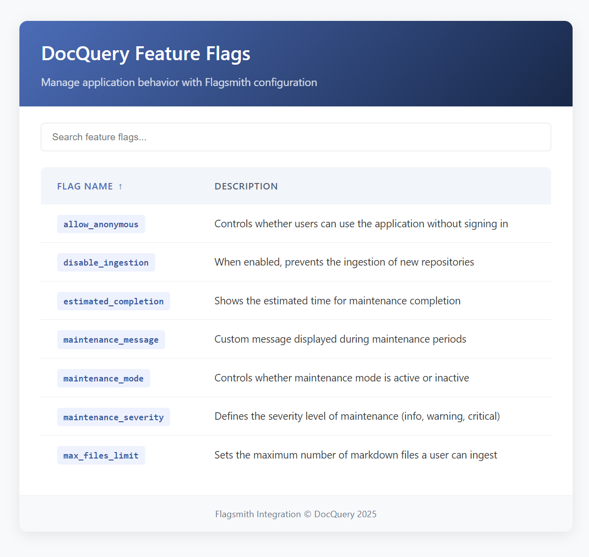

# DocQuery - Flagsmith (HackTheFlag)

## Overview

DocQuery is a comprehensive project consisting of both frontend and backend components. The frontend is built with Next.js and Tailwind CSS, providing a user-friendly interface to create powerful knowledge bases for LLMs using markdown documentation. The backend leverages FastAPI to provide endpoints for different agents built using the `langgraph` library and integrated into the FastAPI application using `CopilotKitSDK`. The application uses `Flagsmith` for feature flag management to control application behavior and enable/disable features dynamically.

## Video: Click to view

[](https://youtu.be/lcyrjW2Db7k)

## Feature Flags



DocQuery uses Flagsmith to implement feature flags that control various aspects of the application:

| Flag Name              | Description                                                         |
| ---------------------- | ------------------------------------------------------------------- |
| `allow_anonymous`      | Controls whether users can use the application without signing in   |
| `disable_ingestion`    | When enabled, prevents the ingestion of new repositories            |
| `estimated_completion` | Shows the estimated time for maintenance completion                 |
| `maintenance_message`  | Custom message displayed during maintenance periods                 |
| `maintenance_mode`     | Controls whether maintenance mode is active or inactive             |
| `maintenance_severity` | Defines the severity level of maintenance (info, warning, critical) |
| `max_files_limit`      | Sets the maximum number of markdown files a user can ingest         |

## Screenshot


## Setup

### Frontend

1. Clone the repository:

   ```sh
   git clone https://github.com/md-abid-hussain/docquery.git
   cd docquery-frontend
   ```

2. Install dependencies:

   ```sh
   npm install
   ```

3. Copy the example environment file and fill in the required values:

   ```sh
   cp .env.example .env
   ```

4. Start the development server:

   ```sh
   npm run dev
   ```

5. The application will be available at `http://localhost:3000`.

### Backend

1. Clone the repository:

   ```sh
   git clone <repository-url>
   cd docquery-backend
   ```

2. Create and activate a virtual environment:

   ```sh
   python -m venv venv
   source venv/bin/activate  # On Windows use `venv\Scripts\activate`
   ```

3. Install dependencies:

   ```sh
   pip install -r requirements.txt
   ```

4. Copy the example environment file and fill in the required values:

   ```sh
   cp .env.example .env
   ```

5. Start the FastAPI server:

   ```sh
   uvicorn app.main:app --reload
   ```

6. The application will be available at `http://127.0.0.1:8000`.

## Features

### Frontend

- **GitHub Integration**: Easily fetch repository details and select markdown files for ingestion.
- **Markdown Processing**: Ingest and process markdown files used for documentation or detailed explanations.
- **Knowledge Base Creation**: Build comprehensive knowledge bases for LLMs from your documentation.
- **AI-Powered Insights**: Leverage advanced LLMs to generate insights and answer queries based on your knowledge base.
- **Feature Flag Management**: Utilize Flagsmith to control application features and behaviors dynamically.

### Backend

#### Ingestion Agent

The Ingestion Agent is defined in agent.py. It consists of the following nodes:

- `Ingestion Node`
- `Verify Ingestion Node`

#### QA Agent

The QA Agent is defined in agent.py. It consists of the following nodes:

- `Retrieve Node`
- `Chat Node`

## API Endpoints

- `GET /`: Returns a simple greeting message.
- `POST /copilotkit`: Endpoint for interacting with the agents.

## Environment Variables

The application requires the following environment variables to be set:

### Frontend

- `TOGETHER_AI_API_KEY`: API key for Together AI services
- `DATABASE_URL`: Connection string for the database
- `COPILOTKIT_RUNTIME_URL`: URL for the CopilotKit runtime
- `AUTH_SECRET`: Secret key for NextAuth.js
- `AUTH_GITHUB_ID`: GitHub OAuth App client ID
- `AUTH_GITHUB_SECRET`: GitHub OAuth App client secret
- `GITHUB_ACCESS_TOKEN`: Personal access token for GitHub API
- `NEXT_PUBLIC_ADMIN_USERS`: List of admin user emails
- `NEXT_PUBLIC_FLAGSMITH_ENVIRONMENT_ID`: Environment ID for Flagsmith feature flags

### Backend

- `GOOGLE_API_KEY`
- `TOGETHER_API_KEY`
- `GITHUB_PERSONAL_ACCESS_TOKEN`
- `MONGODB_ATLAS_CLUSTER_URI`

These can be set in the respective `.env` files.

## License

This project is licensed under the MIT License.
