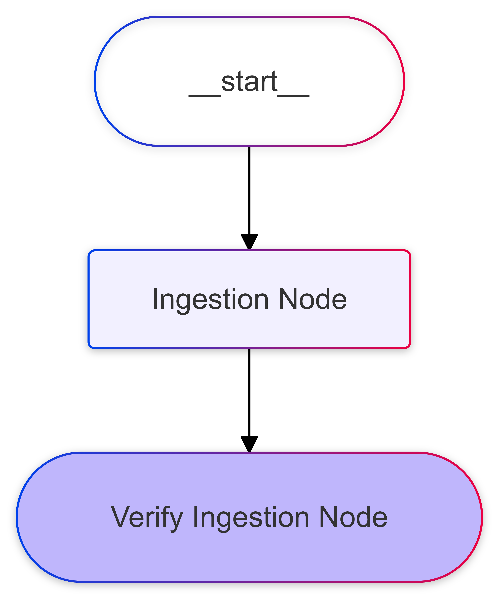
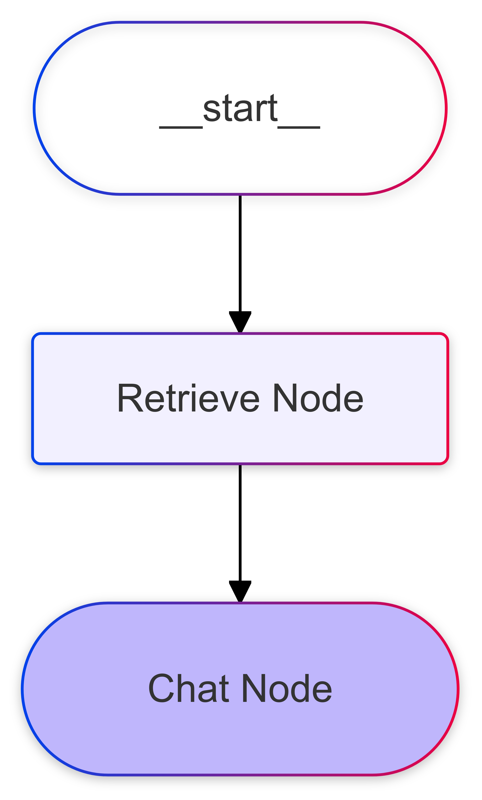

# DocQuery - Agent

## Overview

DocQuery is a backend service that leverages `FastAPI` to provide endpoints for different agents. These agents are built using the `langgraph` library and are integrated into the `FastAPI` application using `CopilotKitSDK`.

## Setup

1. Clone the repository:

    ```sh
    git clone https://github.com/md-abid-hussain/docquery
    cd docquery-backend
    ```

2. Create and activate a virtual environment:

    ```sh
    python -m venv venv
    source venv/bin/activate  # On Windows use `venv\Scripts\activate`
    ```

3. Install dependencies:

    ```sh
    pip install -r requirements.txt
    ```

4. Copy the example environment file and fill in the required values:

    ```sh
    cp .env.example .env
    ```

## Configuring Mongodb Database:

1. Create a cluster 

## Running the Application

1. Start the FastAPI server:

    ```sh
    uvicorn app.main:app --reload
    ```

2. The application will be available at `http://127.0.0.1:8000`.

## Agents

### Ingestion Agent

The Ingestion Agent is defined in `agent/ingestion_agent`. It consists of the following nodes:

- `Ingestion Node`
- `Verify Ingestion Node`

#### Diagram



### QA Agent

The QA Agent is defined in `agent/qa_agent`. It consists of the following nodes:

- `Retrieve Node`
- `Chat Node`

#### Diagram



## Environment Variables

The application requires the following environment variables to be set:

- `GOOGLE_API_KEY`
- `TOGETHER_API_KEY`
- `GITHUB_PERSONAL_ACCESS_TOKEN`
- `MONGODB_ATLAS_CLUSTER_URI`

These can be set in the `.env` file.

## License

This project is licensed under the MIT License.
